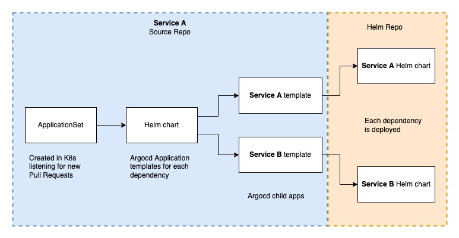

# Argocd AppSet of Apps example

This is an example showing how to use Argocd [ApplicationSets](https://argo-cd.readthedocs.io/en/stable/user-guide/application-set/) to automatically create Git Pull Request preview environments for micro-services. 

This example builds on the [App of Apps pattern](https://argo-cd.readthedocs.io/en/stable/operator-manual/cluster-bootstrapping/#app-of-apps-pattern) by making use of Argcocd ApplicationSets. I call this "Appset of Apps". 

The goal is to automatically deploy a particular application and its dependencies in an isolated K8s namespace whenever a Pull Request is created in Github. Although you can use any other generation method listed [here](https://argocd-applicationset.readthedocs.io/en/stable/Generators/)

## Overview



This example uses 2 git repositories, the first is the `source` repository. It contains the `ApplicationSet` definition as well as a `Helm` chart containing templates of the child apps.

```
Example-repo/
├── helm/
│ ├── templates/
│ │ ├── service-a.yaml
│ │ └── service-b.yaml
│ ├── Chart.yaml
│ └── values.yaml
└── applicationSet.yaml
```

The second repo contains the Helm chart for deploying your applications. Of course, this is Argocd and you can also use Kustomize or plain K8s manifests. For this complete example I am using a slightly modified version of the [example](https://github.com/argoproj/argocd-example-apps/tree/master/apps) "app of apps" helm chart from Argocd 
